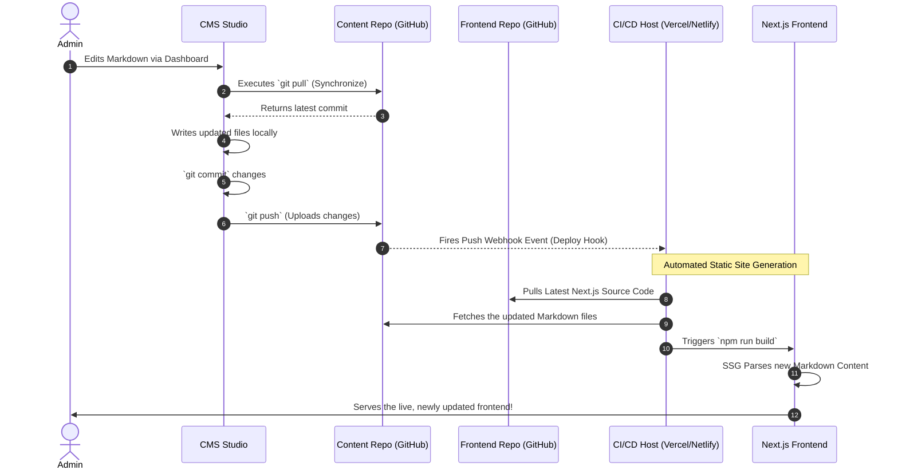

I built this system to solve the problem of content maintenance. Instead of editing code every time I finish a project, I developed a private dashboard that talks directly to GitHub (Content Repository). Every save triggers an automated chain reaction: the system safely commits my changes, alerts my hosting provider, and instantly rebuilds the website. In this case I used Vercel as my hosting provider.

#### System Sequence Diagram



Every project and article in this portfolio is stored as a standard `.md` file, allowing for clean, structured writing that synchronizes effortlessly. Data such as experiences, contact details, and tech stacks are handled via JSON. By utilizing this 'content-as-code' model, the system operates entirely without a traditional database, ensuring maximum portability and performance.

#### Project Repositories

- **Content Source**: [0xfzz-portofolio-content](https://github.com/0xfzz/0xfzz-portofolio-content)
- **Frontend Portfolio**: [0xfzz-portofolio-frontend](https://github.com/0xfzz/0xfzz-portofolio-frontend)
- **CMS Studio**: [0xfzz-portofolio-studio](https://github.com/0xfzz/0xfzz-portofolio-studio)

---

### Technical Challenges & Workarounds

While this decoupled architecture is powerful, it introduced a unique synchronization challenge: **Vercel deployments are usually only triggered by changes in the Frontend repository, not the Content repository.**

To solve this, I implemented two key workarounds:

1. **Automated Build Hooks**: I created a **Vercel Deploy Hook** and linked it to a **GitHub Webhook** in the Content repository. Now, every single save from the CMS Studio triggers a fresh build of the frontend automatically.
2. **Custom Build Pipeline**: Standard submodule behavior often locks to a specific commit. To ensure the portfolio always serves the absolute latest content, I modified the build script to force a recursive update of all submodules before the Next.js build begins.

#### The Build Script Implementation

In the frontend `package.json`, the build command is configured as follows:

```json
{
  "scripts": {
    "build": "git submodule update --remote --recursive && next build"
  }
}
```

### Why this matters

By adding `git submodule update --remote --recursive` directly to the build command, I've ensured that my CI/CD environment (Vercel) ignores cached submodule states and always fetches the most recent commits from the **0xfzz-portofolio-content** repository. This creates a truly seamless, "headless" experience where the website and the data are always in perfect sync.